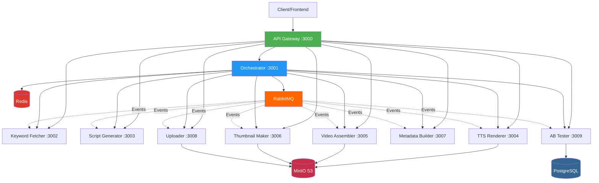
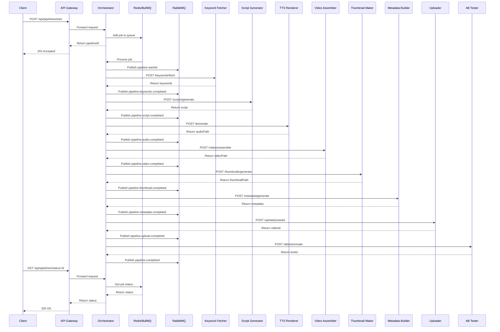
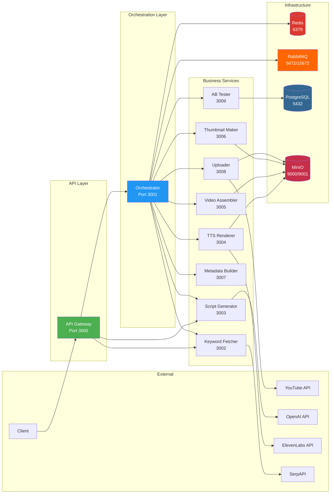
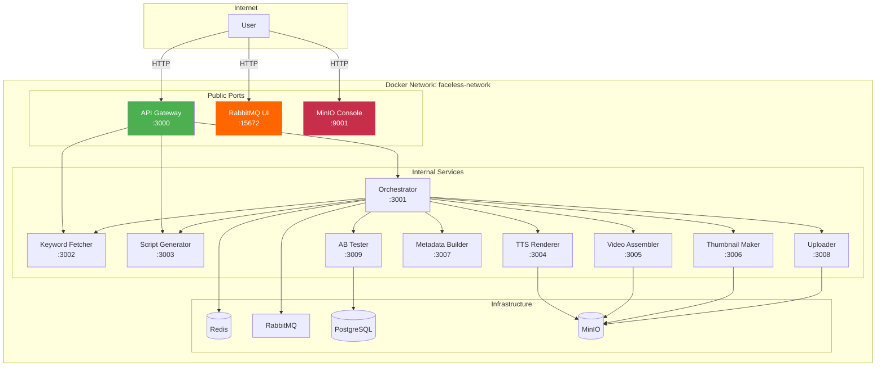
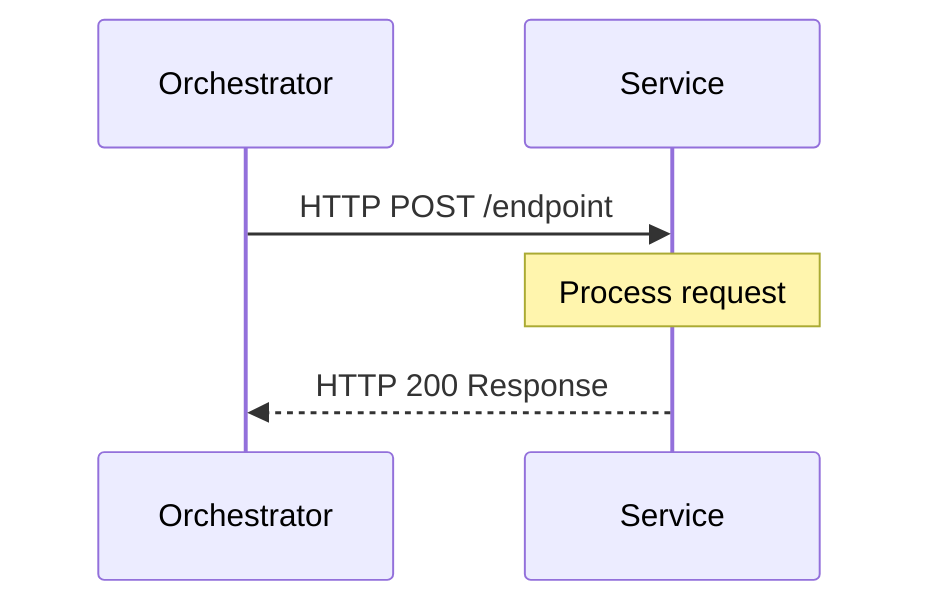
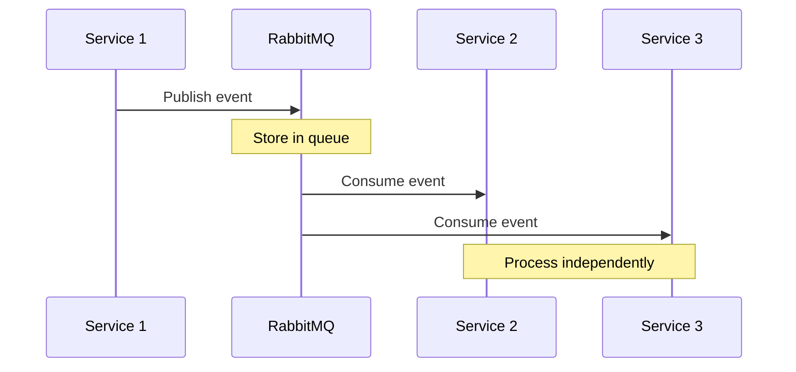
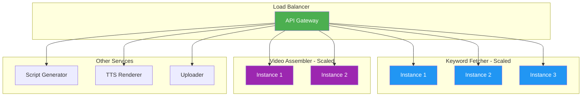
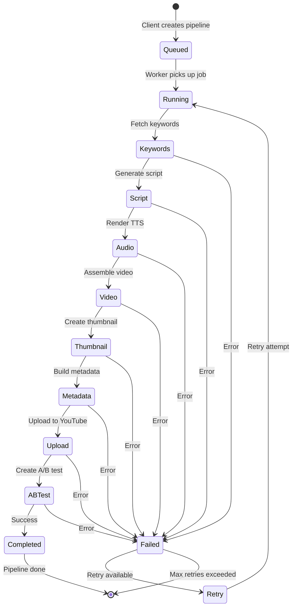
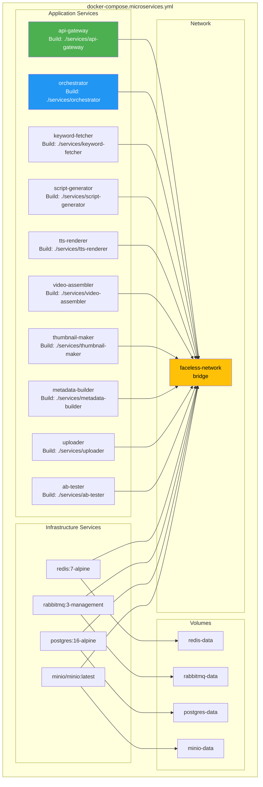
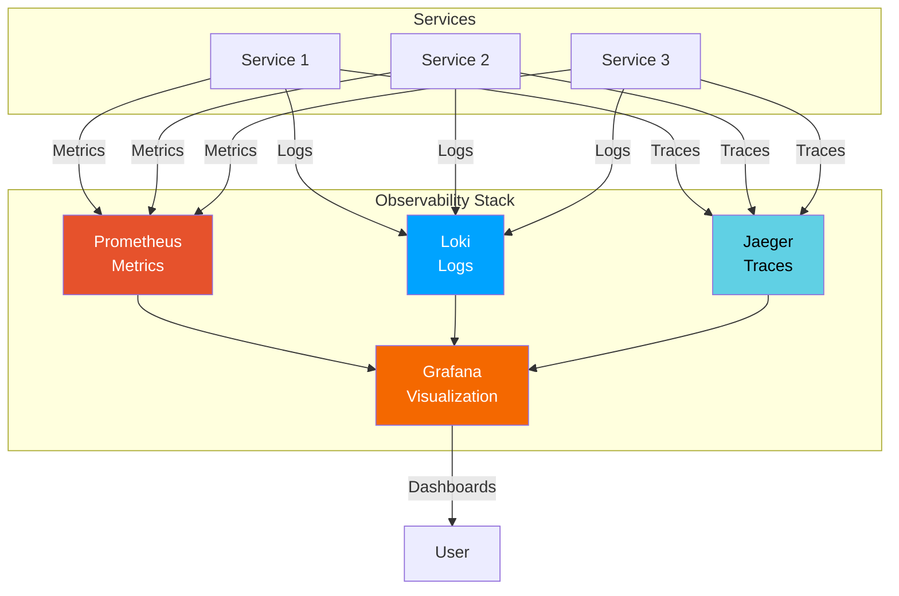

# 🏗️ Diagrammes d'Architecture

## Vue d'ensemble du système

## Flux d'exécution d'un Pipeline

## Architecture des Microservices

## Réseau Docker

## Communication Patterns

### Pattern 1: Synchrone (HTTP)

### Pattern 2: Asynchrone (Events)

## Scalabilité

## États d'un Pipeline

## Déploiement Docker Compose

## Monitoring & Observability (Future)

---

## Légende

- 🟢 **Vert** : Points d'entrée publics (API Gateway)
- 🔵 **Bleu** : Services d'orchestration
- 🔴 **Rouge** : Stockage de données
- 🟠 **Orange** : Message broker
- 🟣 **Violet** : Services métier

## Notes

- Toutes les communications entre services passent par le réseau Docker `faceless-network`
- Seuls les ports suivants sont exposés publiquement :
  - 3000 (API Gateway)
  - 15672 (RabbitMQ UI)
  - 9001 (MinIO Console)
- Les services communiquent en interne via leurs noms de conteneur
- Les données persistantes sont stockées dans des volumes Docker

